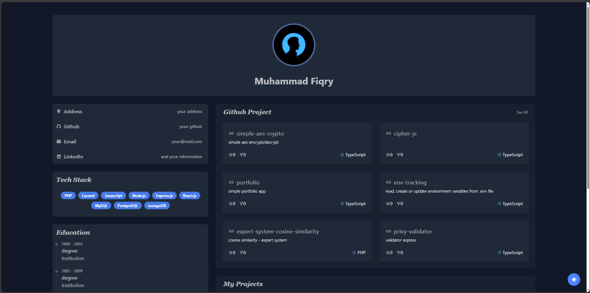

Server-side portfolio app with react and gin-gonic.

### Installation
```bash
git clone https://github.com/Fiqry919/portfolio.git
```
then customize your configuration in `backend/config.json`

<br/>

#### Starting server API
open new terminal/console then go to backend directory `cd ./backend`
```bash
# load .env
cp .env.example .env

# initialize database
go run . db:init

# serve
go run . serve
```
`Note:` every change a configuration you must reinitialize database

<br/>

#### Start frontend
open new terminal/console then go to frontend directory `cd ./frontend`
```bash
# load .env
cp .env.example .env

# install package
npm install

# running
npm run dev
```
<br />




<br />
